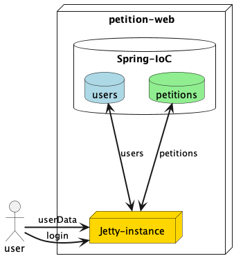

# petition-web

This repo contains a struts2 based web application where a user can:

* login
* see its own data
* make petitions (simple data request)
* see other users
* dismiss user and logout

It uses Spring framework too and has include as maven dependency a Jetty server instance to run the application.

## Config

* JDK17
* Spring 5+
* Struts 6+

## Build

Simply execute

`mvn clean verify`

## Run

Run application with

`mvn jetty:run`

Open a browser in `localhost:8080/petition-web`

## Diagram

